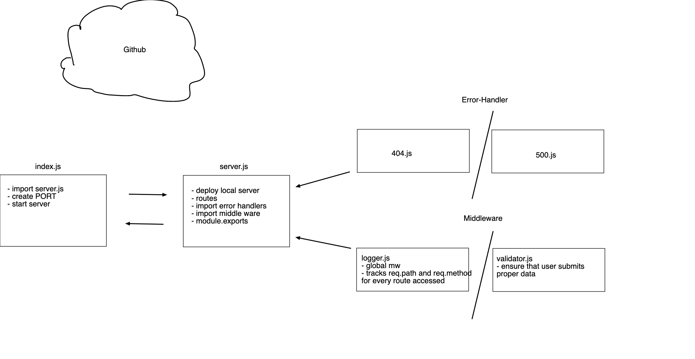

# LAB - Node Ecosystem, CI, CD

## Project: Server Deployment Practice

### Author: Jenner Dulce

### Links and Resources

- [ci/cd](https://github.com/jennerdulce/server-deployment-practice/actions) (GitHub Actions)
- [Pull Request](https://github.com/jennerdulce/server-deployment-practice/pull/3)
- [HEROKU App](https://jennerdulce-server-deploy-dev.herokuapp.com/)

### Setup

#### `.env` requirements (where applicable)

- `PORT` - 3000

#### How to initialize/run your application (where applicable)

- `nodemon`
- `node index.js`
- `npm start`

#### How to use your library (where applicable)

#### Tests

- no testing for this lab

#### UML

;
